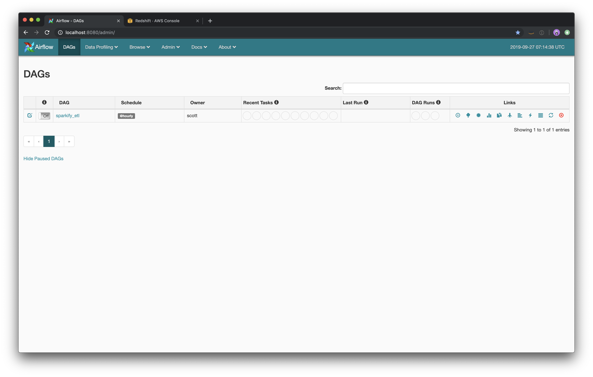

# Data Pipelines with Airflow
## Udacity Data Engineering Nanodegree, Project 5

Sparkify, has decided that it is time to introduce more automation and monitoring to their data warehouse ETL pipelines and come to the conclusion that the best tool to achieve this is Apache Airflow.

They have also noted that the data quality plays a big part when analyses are executed on top the data warehouse and want to run tests against their datasets after the ETL steps have been executed to catch any discrepancies in the datasets.

The source data resides in S3 and needs to be processed into Amazon Redshift. The source datasets consist of JSON logs that tell about user activity in the application and JSON metadata about the songs the users listen to.

## DAG structure


## About the operators
There are four different custom operators that stage the data, transform the data, and run checks on data quality.

### Stage Operator
The stage operator loads any JSON formatted files from S3 to Amazon Redshift. The operator creates and runs a SQL COPY statement based on the parameters provided. The operator's parameters should specify where in S3 the file is loaded and what is the target table.

The parameters should be used to distinguish between JSON file. Another important requirement of the stage operator is containing a templated field that allows it to load timestamped files from S3 based on the execution time and run backfills.

### Fact and Dimension Operators
With dimension and fact operators, you can utilize the provided SQL helper class to run data transformations. Most of the logic is within the SQL transformations and the operator is expected to take as input a SQL statement or path to a SQL template and target table on which to run the query against.

Dimension loads are often done with the truncate-insert pattern where the target table is emptied before the load. Thus, you could also have a parameter that allows switching between insert modes when loading dimensions. Fact tables are usually so massive that they should only allow append type functionality.

### Data Quality Operator
The final operator to create is the data quality operator, which is used to run checks on the data itself. The operator's main functionality is to receive one or more SQL based test cases along with the expected results and execute the tests. For each the test, the test result and expected result needs to be checked and if there is no match, the operator should raise an exception and the task should retry and fail eventually.

For example one test could be a SQL statement that checks if certain column contains NULL values by counting all the rows that have NULL in the column. We do not want to have any NULLs so expected result would be 0 and the test would compare the SQL statement's outcome to the expected result.

## Requirements
* [Docker](https://docs.docker.com/install/)
* [Docker-compose](https://docs.docker.com/compose/install/)
* Redshift cluster and credentials
  * See [this section](https://github.com/ScottFitzgerald83/data-warehousing#setting-up-the-cluster) and [this script](https://github.com/ScottFitzgerald83/data-warehousing/blob/master/utils/create_cluster.py) for a cluster-provisioning tool I like to use
* Redshift credentials stored in environment variables or `.env` file ([see below](https://github.com/ScottFitzgerald83/data-pipelines#setting-up-redshift-and-iam-credentials))

## Getting started
After cloning the repository and setting up Docker and Redshift, you'll need to configure your Redshift connection and IAM role ARN.

### Setting up Redshift and IAM credentials
In `docker-compose.yml`, there is a line that reads in the Redshift and IAM config from environment variables:
```
AIRFLOW_CONN_REDSHIFT=${SCHEME}://${DBUSER}:${PASSWORD}@${HOST}:${PORT}/${SCHEMA}?iam_role=${IAM_ROLE}&region=${REGION}
```
These values can either be set as environment variables or in an [`.env` file](https://docs.docker.com/compose/env-file/) like so:
```
SCHEME=redshift
DBUSER=airflow
PASSWORD=$uP3r$3cR3tp@$$w0rd
HOST=cluster-identifier.cqj47w2bzilb.us-west-2.redshift.amazonaws.com
PORT=5439
SCHEMA=sparkify
IAM_ROLE=arn:aws:iam::123456789012:role/airflow_redshift_s3
REGION=us-west-2
``` 
docker-compose will magically read these values into environment variables when you build the container and interpolate them into the above connection string, passing the `AIRFLOW_CONN_REDSHIFT` URI to Airflow as an environment variable. 

Airflow will use this value to create the Redshift connection with the IAM role as an extra json parameter. The IAM role is required for the `COPY` commands. The IAM role is pulled from this connection object and stored in a variable here:
```
IAM_ROLE = BaseHook.get_connection("redshift").extra_dejson.get('iam_role')
```

### Running the app with Docker 
 Next, you can create a container with `docker-compose up -d`. This will launch the webserver and Postgres database in the background:
```
fitscott (master) data-pipelines
$ docker-compose up -d
Starting data-pipelines_postgres_1 ... done
Starting data-pipelines_webserver_1 ... done
```
After launching the container, head over to the Airflow UI at `http://localhost:8080/admin/`.
You should see the sparkify_etl DAG, which you can toggle to on to trigger:



### Helpful docker/docker-compose commands
#### View running containers
`docker ps`
```
fitscott (master) data-pipelines
$ docker ps
CONTAINER ID        IMAGE                          COMMAND                  CREATED             STATUS                            PORTS                                        NAMES
d3b72c0b16f5        puckel/docker-airflow:latest   "/entrypoint.sh webs…"   8 seconds ago       Up 7 seconds (health: starting)   5555/tcp, 8793/tcp, 0.0.0.0:8080->8080/tcp   data-pipelines_webserver_1
8c8085be2ae1        postgres:9.6                   "docker-entrypoint.s…"   9 seconds ago       Up 8 seconds                      5432/tcp                                     data-pipelines_postgres_1
```
#### Stop or stop and remove a container
`docker-compose stop` stops the containers, and `docker-compose start` will start them back up.

`docker-compose down <container-id>` will stop and remove a container.
 
#### Restarting a container
`docker restart <container-id> `

#### Viewing logs
Viewing the logs is also helpful when debugging issues. `docker logs <container-id>`
```
fitscott (master) data-pipelines
$ docker logs 0d7c2b40fdc1 --tail 10
[2019-09-27 08:36:32,116] {base_hook.py:84} INFO - Using connection to: id: redshift. Host: cluster-identifier.cqj47w2bzilb.us-west-2.redshift.amazonaws.com, Port: 5439, Schema: sparkify, Login: airflow, Password: XXXXXXXX, extra: {'iam_role': 'arn:aws:iam::123456789012:role/airflow_redshift_s3', 'region': 'us-west-2'}
[2019-09-27 08:36:32 +0000] [173] [INFO] Handling signal: ttou
[2019-09-27 08:36:32 +0000] [178] [INFO] Worker exiting (pid: 178)
[2019-09-27 08:37:03 +0000] [173] [INFO] Handling signal: ttin
[2019-09-27 08:37:03 +0000] [733] [INFO] Booting worker with pid: 733
[2019-09-27 08:37:03,087] {__init__.py:51} INFO - Using executor LocalExecutor
[2019-09-27 08:37:03,365] {dagbag.py:90} INFO - Filling up the DagBag from /usr/local/airflow/dags
[2019-09-27 08:36:32,116] {base_hook.py:84} INFO - Using connection to: id: redshift. Host: cluster-identifier.cqj47w2bzilb.us-west-2.redshift.amazonaws.com, Port: 5439, Schema: sparkify, Login: airflow, Password: XXXXXXXX, extra: {'iam_role': 'arn:aws:iam::123456789012:role/airflow_redshift_s3', 'region': 'us-west-2'}
[2019-09-27 08:37:04 +0000] [173] [INFO] Handling signal: ttou
[2019-09-27 08:37:04 +0000] [185] [INFO] Worker exiting (pid: 185)
```


